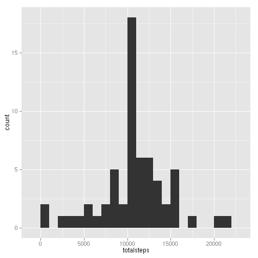

## Loading and preprocessing the data

```r
if(!dir.exists("data"))
    dir.create("data")
if(length(list.files("data")) == 0)
    unzip("activity.zip", exdir = "data")
data <- read.csv(file.path("data", list.files("data")[1]))
```

To better print and view the data, let's wrap the raw data.

```r
library(dplyr)
data <- tbl_df(data)
summary(data)
```

```
##      steps                date          interval     
##  Min.   :  0.00   2012-10-01:  288   Min.   :   0.0  
##  1st Qu.:  0.00   2012-10-02:  288   1st Qu.: 588.8  
##  Median :  0.00   2012-10-03:  288   Median :1177.5  
##  Mean   : 37.38   2012-10-04:  288   Mean   :1177.5  
##  3rd Qu.: 12.00   2012-10-05:  288   3rd Qu.:1766.2  
##  Max.   :806.00   2012-10-06:  288   Max.   :2355.0  
##  NA's   :2304     (Other)   :15840
```

The *steps* variable has `NA` values.

## What is mean total number of steps taken per day?

```r
totalsteps_by_date <- data %>% 
    group_by(date) %>% 
    summarise(totalsteps = sum(steps, na.rm =T))
```

First, let's check the histogram of the total number of steps per day.


```r
library(ggplot2)
g_hist <- ggplot(totalsteps_by_date, aes(x = totalsteps)) +
    geom_histogram(binwidth = 1000)
g_hist 
```

 

And the mean and median of the total number of steps per day are as follow:


```r
mean_steps <- round(mean(totalsteps_by_date$totalsteps))
mean_steps
```

```
## [1] 9354
```

```r
median_steps <- median(totalsteps_by_date$totalsteps)
median_steps
```

```
## [1] 10395
```

## What is the average daily activity pattern?

```r
ave_by_interval <- data %>%
    group_by(interval) %>%
    summarise(ave_steps = round(mean(steps, na.rm = T)))
g <- ggplot(ave_by_interval, aes(x = interval, y = ave_steps))
g + geom_line()
```

 

And the 5-minute interval containing the maximum average steps per interval across all the days is:


```r
max_avg_steps <- max(ave_by_interval$ave_steps) 
max_avg_interval <- ave_by_interval[ave_by_interval$ave_steps == max_avg_steps, "interval"]
max_avg_interval[[1]]
```

```
## [1] 835
```

## Imputing missing values

The total number of missing values is:

```r
totalNA <- sum(is.na(data$steps))
totalNA
```

```
## [1] 2304
```

To fill the value with NA, one strategy is to replace that NA with the mean of the same interval across all days as follows. And to accelerate the search for the average value, we convert the `ave_by_interval` to a `data_table` object at first.


```r
library(data.table)
idxed_ave_by_interval <- data.table(ave_by_interval, key = "interval")

imputed_steps <- unlist(apply(data, 1, function(r){
    ifelse(is.na(r[["steps"]]),
        idxed_ave_by_interval[idxed_ave_by_interval$interval == as.numeric(r[["interval"]]), ]$ave_steps,
        as.numeric(r[["steps"]]))
}))
imputed_data <- mutate(data,  steps = imputed_steps)
```

Then let's repeat the steps under the first question to compare the new data set with the raw data set.


```r
imputed_totalsteps_by_date <- imputed_data %>% 
    group_by(date) %>% 
    summarise(totalsteps = sum(steps, na.rm =T))
imputed_g_hist <- ggplot(imputed_totalsteps_by_date, aes(x = totalsteps)) + 
    geom_histogram(binwidth = 1000)
imputed_g_hist
```

 

And the new mean and median values are:

```r
imputed_mean_steps <- round(mean(imputed_totalsteps_by_date$totalsteps))
imputed_mean_steps
```

```
## [1] 10766
```

```r
imputed_median_steps <- median(imputed_totalsteps_by_date$totalsteps)
imputed_median_steps
```

```
## [1] 10762
```

To compare those results with the raw data, let's collocate the two histogram plots.

```r
library(gridExtra)
grid.arrange(g_hist + ggtitle("raw"), imputed_g_hist + ggtitle("imputed"), ncol = 2)
```

 

And the data comparisons of the mean and median values are:

```r
data.frame(label = c("raw", "imputed"), 
           mean = c(mean_steps, imputed_mean_steps), 
           median = c(median_steps, imputed_median_steps))
```

```
##     label  mean median
## 1     raw  9354  10395
## 2 imputed 10766  10762
```

From the above plots and comparison result, we could find that the raw steps data are biased by those NA values. For those days that have no or few records of steps per interval, the total steps in that day is nearly zero. That makes **the esitimates from the first part of the assignmen lower than the imputed version of the same data set**, especially for the mean value. 

## Are there differences in activity patterns between weekdays and weekends?

```r
library(lubridate)
weekstatus <- apply(imputed_data, 1, function(r){
        ifelse(weekdays(ymd(r[["date"]]), T) %in% c("Sat", "Sun"), "weekend", "weekday")
    })
imputed_data <- mutate(imputed_data, weekstatus = weekstatus)
imputed_data
```

```
## Source: local data frame [17,568 x 4]
## 
##    steps       date interval weekstatus
## 1      2 2012-10-01        0    weekday
## 2      0 2012-10-01        5    weekday
## 3      0 2012-10-01       10    weekday
## 4      0 2012-10-01       15    weekday
## 5      0 2012-10-01       20    weekday
## 6      2 2012-10-01       25    weekday
## 7      1 2012-10-01       30    weekday
## 8      1 2012-10-01       35    weekday
## 9      0 2012-10-01       40    weekday
## 10     1 2012-10-01       45    weekday
## ..   ...        ...      ...        ...
```

And now let's explore the differences between weekdays and weekdays.

```r
imputed_data_by_week <- imputed_data %>% 
    group_by(weekstatus, interval) %>%
    summarise(meansteps = mean(steps))
library(lattice)
xyplot(meansteps ~ interval | weekstatus, imputed_data_by_week, 
       ylab = "Number of steps", xlab = "Interval", 
       layout = c(1, 2), type = "l")
```

 

